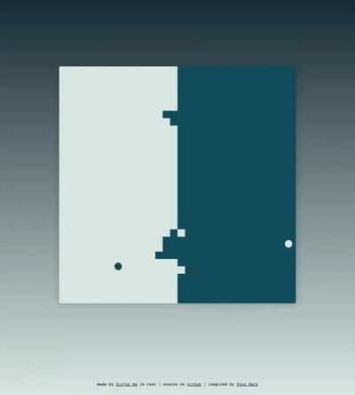

# Pong Wars

A real-time territory-war visualization, written in Rust and compiled to
WebAssembly. Two balls bounce around an 800×800 canvas, each repainting its
team's color on every cell it touches — over time the boundary between the two
teams settles into organic, fractal-ish battle lines.

The canvas is partitioned into a 32×32 grid of 25-pixel squares. Each square
belongs to one of two teams — *day* (light mint, `#D9E8E3`) and *night* (deep
teal, `#114C5A`) — and each ball carries a color pair: a ball color and the
color it paints over cells. On every animation frame each ball advances one
step, repaints every square it crosses, and bounces off the canvas edges. The
score panel tracks live cell counts per team.

The whole game is a single Rust crate that compiles to WebAssembly with no
JavaScript framework or runtime dependency. `wasm-bindgen` exposes one entry
point, `web-sys` provides the canvas and 2D context, and the animation loop is
driven by `requestAnimationFrame` via a recursive `Closure<dyn FnMut()>` — all
from safe Rust, all without writing a single line of JS. Inspired by
[Pong Wars](https://github.com/vnglst/pong-wars) by vnglst.

## Demo

<p align="center">
  
</p>

## Development

Run:

```sh
trunk serve
```

## Links

- Original: https://github.com/vnglst/pong-wars
